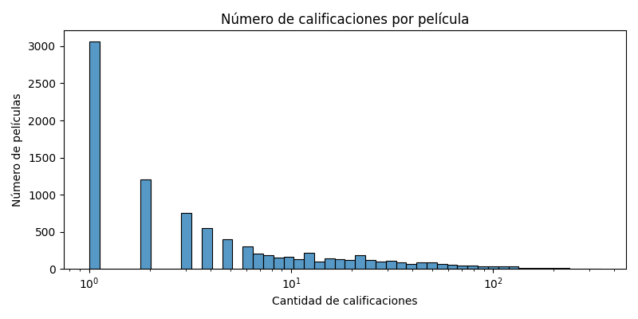

# Reporte de Datos

Este documento contiene los resultados del análisis exploratorio de datos.

## Resumen general de los datos

En esta sección se presenta un resumen general de los conjuntos de datos utilizados:

#### ratings_small.csv:
- **Número total de observaciones**: 100004  
- **Número de variables**: 4  
- **Variables y tipos**:
  - `userId` (`int`): Id del usuario.
  - `movieId` (`int`): Id de la película.
  - `rating` (`float`): Calificación dada por el usuario (de 0.5 a 5.0).
  - `timestamp` (`int`): Fecha de la calificación (Formato UNIX).
- **Valores faltantes**: Ninguno.
- **Distribución de la variable `rating`**:
  - Media: **3.54**
  - Rango: **0.5** a **5.0**

#### links_small.csv:

- **Número total de observaciones**: 9.125  
- **Número de variables**: 3  
- **Variables y tipos**:
  - `movieId` (`int`): Identificador de la película en MovieLens.
  - `imdbId` (`int`): Identificador en IMDb.
  - `tmdbId` (`float`): Identificador en TMDb.
- **Valores faltantes**:
  - `tmdbId`: **13** valores nulos.
  - `movieId` e `imdbId`: **sin valores nulos**.

---
## Resumen de calidad de los datos

En esta sección se presenta un resumen de la calidad de los datos. Se describe la cantidad y porcentaje de valores faltantes, valores extremos, errores y duplicados. También se muestran las acciones tomadas para abordar estos problemas.

---

#### ratings_small.csv:

- **Valores faltantes**: No se encontraron valores nulos en ninguna de las columnas.
- **Valores extremos**:
  - Calificaciones válidas: entre **0.5** y **5.0**, en pasos de **0.5**.
  - No se identificaron valores fuera del rango esperado.
- **Errores**: No se observaron errores evidentes en los tipos o formatos de datos.
- **Duplicados**: No se detectaron filas duplicadas exactas.
- **Acciones tomadas**: No se requirió limpieza en esta etapa.

---

#### links_small.csv:

- **Valores faltantes**:
  - `tmdbId`: **13 valores nulos** (*0.14% del total*).
  - `movieId` e `imdbId`: sin valores faltantes.
- **Valores extremos y errores**: No se identificaron inconsistencias numéricas o de formato.
- **Duplicados**: No se encontraron duplicados.
- **Acciones tomadas**:
  - Se identificaron los registros con `tmdbId` nulo para su posible tratamiento posterior.

---

## Variable objetivo

En esta sección se describe la variable objetivo. Se muestra la distribución de la variable y se presentan gráficos que permiten entender mejor su comportamiento.

####  Variable objetivo: `rating` 

- Esta variable representa la el puntaje dado por un usuario a una película.
- Escala de valores: de **0.5** a **5.0**, en incrementos de **0.5**.
- Tipo de variable: **Numérica continua (discreta en la práctica)**

####  Distribución`:

| Calificación | Porcentaje |
|--------------|---------------------|
| 0.5          | 1.10%            |
| 1.0          | 3.32%           |
| 1.5          | 1.69%            |
| 2.0          | 7.27%            |
| 2.5          | 4.45%           |
| 3.0          | 20.06%            |
| 3.5          | 10.54%          |
| 4.0          | 28.75%            |
| 4.5          | 7.72%            |
| 5.0          | 15.09%            |

####  Histograma:

## Variables individuales

En esta sección se presenta un análisis detallado de cada variable individual. Se muestran estadísticas descriptivas, gráficos de distribución y de relación con la variable objetivo (si aplica). Además, se describen posibles transformaciones que se pueden aplicar a la variable.

#### Variable: `userId`

- **Tipo**: Numérica (entero)
- **Descripción**: Identificador único del usuario que realiza la calificación.
- **Estadísticas**:
  - Total de usuarios únicos: 671
  - Calificaciones por usuario: mínimo 1, máximo 2391
- **Distribución**: Altamente sesgada; la mayoría califica pocas películas.
- **Relación con `rating`**: No aplica directamente, pero puede influir en modelos colaborativos.

#### Promedio de calificaciónes por usuario:

#### Variable: `movieId`

- **Tipo**: Numérica (entero)
- **Descripción**: Identificador único de la película.
- **Películas únicas**: 9.066
- **Calificaciones por película**:
  - Mínimo: 1
  - Máximo: 341
- **Relación con `rating`**: Es la característica sobre la cual se asignan las calificaciones.

#### Calificaciónes por película:

#### Variable: `timestamp`

- **Tipo**: Numérica (entero UNIX)
- **Descripción**: Momento en que se hizo la calificación.
- **Rango**:
  - Desde: 1995-01-09
  - Hasta: 2016-10-16
- **Relación con `rating`**: Permite análisis temporal.

---

## Ranking de variables

### Análisis de importancia de variables

#### Variables utilizadas:
- `userId`
- `movieId`
- `timestamp`
---

#### Importancia de las variables (Random Forest)

| Variable   | Importancia (%) |
|------------|------------------|
| `movieId`  | 61.69%           |
| `userId`   | 29.65%           |
| `timestamp`| 8.66%            |

**Conclusión**: La variable más importante para predecir `rating` en este modelo es `movieId`, seguida por `userId`. `timestamp` también aporta información, aunque en menor medida.

---

## Relación entre variables explicativas y variable objetivo

En esta sección se presenta un análisis de la relación entre las variables explicativas y la variable objetivo. Se utilizan gráficos como la matriz de correlación y el diagrama de dispersión para entender mejor la relación entre las variables. Además, se pueden utilizar técnicas como la regresión lineal para modelar la relación entre las variables.

#### Matriz de correlación

Se calcula la matriz de correlación de Pearson entre las variables numéricas (`userId`, `movieId`, `timestamp`) y la variable objetivo (`rating`). 

