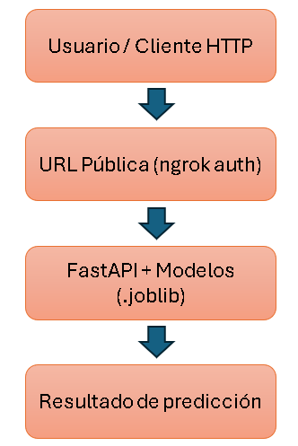

# Despliegue de modelos

## Infraestructura

- **Nombres de los modelos:** `logistic_regression`, `random_forest`, `svm_rbf`, `gradient_boosting`.
- **Plataforma de despliegue:** API local desarrollada con FastAPI, expuesta remotamente a través de ngrok.
- **Requisitos técnicos:** Python 3.10

    Librerías de Python:

    - `fastapi`
    - `uvicorn`
    - `joblib`
    - `scikit-learn`
    - `pyngrok`

    Directorio models/ con los siguientes archivos:
    - `logistic_regression.joblib`
    - `random_forest.joblib`
    - `svm_rbf.joblib`
    - `gradient_boosting.joblib`

- **Requisitos de seguridad:** El túnel remoto se genera usando ngrok autenticado, lo que permite mayor estabilidad y control.
- **Diagrama de arquitectura:** 

## Código de despliegue

- **Archivo principal:** `scripts/deployment/main.py`
- **Rutas de acceso a los archivos:** 
    - `models/logistic_regression.joblib`
    - `models/random_forest.joblib`
    - `models/svm_rbf.joblib`
    - `models/gradient_boosting.joblib`
    - `ngrok_runner.py` (orquestador del API + túnel)
- **Variables de entorno:** 
    - NGROK_AUTH_TOKEN: token de autenticación de ngrok 
## Documentación del despliegue

- **Instrucciones de instalación:**  Se crea un entorno virtual con las librerías requeridas
`python -m venv venv`
`source venv/bin/activate` 
`pip install -r requirements.txt`

- **Instrucciones de configuración:** Para la configuración se necesita poner el token de ngrok, para esto podemos realizarlo de 2 maneras: 
    1. `ngrok config add-authtoken TU_TOKEN` en consola
    2. En el código de `ngrok_runner.py` asignar la variable `NGROK_AUTH_TOKEN`
- **Instrucciones de uso:** Ejecutar: `python ngrok_runner.py` en consola.
- **Instrucciones de mantenimiento:** 
    - Reemplazar modelos .joblib en models/ si se desea actualizar.
    - Mantener actualizado el archivo requirements.txt.
    - El túnel puede ser monitorizado o restringido desde la consola de ngrok.
